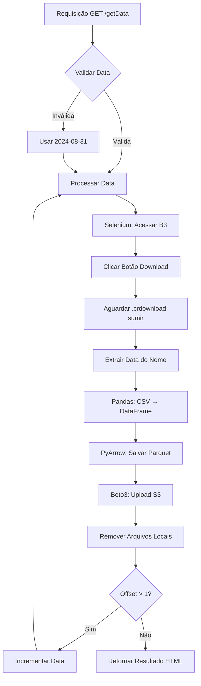

<div align="center">

# 📊 Tech Challenge - Fase 2
### Pipeline Batch Bovespa B3

[](https://www.python.org/)
[](https://flask.palletsprojects.com/)
[](https://aws.amazon.com/)
[](LICENSE)

**Pós Tech FIAP - Machine Learning Engineering**

*Pipeline completo de ETL para extração, processamento e análise de dados do pregão D-1 da B3*

[Características](#-características) •
[Arquitetura](#-arquitetura) •
[Instalação](#-instalação) •
[Uso](#-uso) •
[Documentação](#-documentação) •
[Equipe](#-equipe)

</div>

---

## 📋 Sobre o Projeto

Este projeto implementa uma solução completa de **Data Engineering** para ingestão e processamento de dados da **B3 (Bolsa de Valores do Brasil)**. A solução automatiza o download de arquivos CSV de pregões consolidados, converte-os para o formato **Parquet** (otimizado para Big Data), e armazena no **AWS S3** para posterior processamento via **AWS Glue** e análise com **Amazon Athena**.

### 🎯 Objetivos do Tech Challenge

- ✅ **Requisito 1**: Web scraping automático de dados do pregão D-1 da B3
- ✅ **Requisito 2**: Ingestão de dados brutos no S3 em formato Parquet com partição diária
- ✅ **Requisito 3**: Arquitetura serverless com Lambda e Glue
- ✅ **Requisito 4-9**: Pipeline ETL completo com transformações e catalogação automática

---

## 🚀 Características

| Recurso | Descrição |
|---------|-----------|
| 🤖 **Automação Inteligente** | Selenium + ChromeDriver para download automático sem intervenção manual |
| 📦 **Formato Otimizado** | Conversão CSV → Parquet com compressão PyArrow (até 80% de economia) |
| ☁️ **Cloud Native** | Integração nativa com AWS S3, Lambda e Glue |
| 🔄 **Batch Processing** | Suporte a múltiplas datas consecutivas via parâmetro `offset` |
| 🐍 **Python Puro** | Flask + Pandas + Boto3 - stack Python moderno e eficiente |
| 🔐 **Segurança** | Credenciais gerenciadas via variáveis de ambiente |

---

## 🏗️ Arquitetura

```
┌─────────────┐     ┌──────────────┐     ┌─────────────┐     ┌──────────────┐
│   Flask     │────▶│   Selenium   │────▶│  Pandas +   │────▶│   AWS S3     │
│   API       │     │  Web Scraper │     │  PyArrow    │     │  (Parquet)   │
└─────────────┘     └──────────────┘     └─────────────┘     └──────────────┘
                           │                                          │
                           ▼                                          ▼
                    ┌──────────────┐                         ┌──────────────┐
                    │  B3 Website  │                         │ AWS Lambda   │
                    │ (CSV Files)  │                         │    Trigger   │
                    └──────────────┘                         └──────────────┘
                                                                     │
                                                                     ▼
                                                              ┌──────────────┐
                                                              │  AWS Glue    │
                                                              │   ETL Job    │
                                                              └──────────────┘
                                                                     │
                                                                     ▼
                                                              ┌──────────────┐
                                                              │   Athena     │
                                                              │  Analytics   │
                                                              └──────────────┘
```

### 📂 Estrutura do Projeto

```
Tech-Challenge-F2/
├── 📁 libs/                    # Módulos customizados
│   ├── getFile.py             # Download + Conversão (Selenium + Pandas)
│   ├── moveS3.py              # Upload para S3 (Boto3)
│   └── sumDay.py              # Utilitário de manipulação de datas
├── 📁 video_entrega/          # Vídeos de apresentação do projeto
├── 📄 app.py                  # Servidor Flask (API REST)
├── 📄 lambdaAWS.py            # Handler AWS Lambda para Glue
├── 📄 requirements.txt        # Dependências Python
└── 📄 README.md               # Este arquivo
```

---

## 🛠️ Instalação

### Pré-requisitos

- **Python 3.8+** instalado
- **Google Chrome** instalado (para Selenium)
- **AWS CLI** configurado com credenciais válidas
- **Conta AWS** com permissões para S3, Lambda e Glue

### 1️⃣ Clone o Repositório

```bash
git clone https://github.com/seu-usuario/Tech-Challenge-F2.git
cd Tech-Challenge-F2
```

### 2️⃣ Instale as Dependências

```bash
pip install -r requirements.txt
```

**Dependências principais:**
- `Flask==3.0.3` - Framework web
- `pandas==2.2.2` - Manipulação de dados
- `pyarrow==17.0.0` - Engine Parquet
- `selenium==4.24.0` - Web scraping
- `boto3==1.35.14` - AWS SDK

### 3️⃣ Configure as Variáveis de Ambiente

Crie um arquivo `.env` na raiz do projeto:

```bash
# AWS Credentials (opcional se já configurado via AWS CLI)
AWS_ACESS_KET_ID=sua_access_key
AWS_SECRET_ACESS_KEY=sua_secret_key
AWS_BUCKET_NAME=nome-do-seu-bucket-s3
```

> **Nota**: As credenciais AWS podem ser gerenciadas pelo AWS CLI. Execute `aws configure` se ainda não configurou.

### 4️⃣ Execute a Aplicação

```bash
python app.py
```

O servidor Flask iniciará em `http://localhost:5000`

---

## 💻 Uso

### 🔹 Endpoint Principal: `/getData`

**Descrição**: Realiza o download de dados do pregão da B3, converte para Parquet e envia para S3.

#### Parâmetros

| Parâmetro | Tipo | Descrição | Padrão | Exemplo |
|-----------|------|-----------|--------|---------|
| `data` | `string` | Data do pregão no formato `YYYY-MM-DD` | `2024-08-31` | `2024-10-01` |
| `offset` | `int` | Número de dias consecutivos a processar | `1` | `5` |

#### 📌 Exemplos de Uso

**1. Processar data padrão (2024-08-31):**
```bash
curl http://localhost:5000/getData
```

**2. Processar data específica:**
```bash
curl "http://localhost:5000/getData?data=2024-10-01"
```

**3. Processar 7 dias consecutivos a partir de 01/10/2024:**
```bash
curl "http://localhost:5000/getData?data=2024-10-01&offset=7"
```

#### 📤 Resposta Esperada

```html
OK - DATA: 2024-10-01 - Arquivo baixado com sucesso, convertido em parquet & movido - /temp_files/2024-10-01.parquet <br><br>
OK - DATA: 2024-10-02 - Arquivo baixado com sucesso, convertido em parquet & movido - /temp_files/2024-10-02.parquet <br><br>
2024-10-03 - Não há informações para essa data, **DELETED** <br><br>
```

---

## 📊 Fluxo de Execução Detalhado



### 🔍 Passos Detalhados

1. **Validação de Entrada**
   - Verifica formato da data (regex `YYYY-MM-DD`)
   - Aplica data padrão se inválida

2. **Web Scraping (Selenium)**
   - Acessa `https://arquivos.b3.com.br/tabelas/TradeInformationConsolidatedAfterHours/{data}`
   - Modo headless (sem interface gráfica)
   - Aguarda botão de download estar clicável (timeout 20s)

3. **Monitoramento de Download**
   - Detecta arquivo `.crdownload` (Chrome)
   - Polling a cada 500ms até conclusão
   - Delay de segurança de 5s

4. **Processamento**
   - Extração de data do nome do arquivo via regex (`_YYYYMMDD_`)
   - Leitura CSV com delimitador `;` (formato B3)
   - Conversão para Parquet com compressão

5. **Upload e Limpeza**
   - Upload para `s3://{bucket}/rawData/{YYYY-MM-DD}.parquet`
   - Remoção de arquivos temporários

---

## 🧩 Módulos

### 📦 `libs/getFile.py`

**Responsabilidade**: Orquestração do pipeline de download e conversão.

```python
def getcsv():
    """
    Extrai dados da B3, converte para Parquet e envia para S3.

    Returns:
        str: HTML com status de cada data processada
    """
```

**Configurações Selenium**:
- ✅ Headless mode
- ✅ No-sandbox
- ✅ Disable dev-shm-usage
- ✅ Download automático via ChromeDriverManager

---

### ☁️ `libs/moveS3.py`

**Responsabilidade**: Upload de arquivos para AWS S3.

```python
def moveToS3(fullPath: str, fileName: str):
    """
    Envia arquivo local para S3 e remove o original.

    Args:
        fullPath: Caminho completo do arquivo local
        fileName: Caminho de destino no S3 (ex: 'rawData/2024-08-31.parquet')
    """
```

**Características**:
- Cliente S3 com região `us-east-1`
- Remoção automática após upload bem-sucedido
- Tratamento de exceções silencioso (log em produção)

---

### 📅 `libs/sumDay.py`

**Responsabilidade**: Incremento inteligente de datas.

```python
def sumDay(currentDate: str) -> str:
    """
    Incrementa um dia na data fornecida.

    Args:
        currentDate: Data no formato 'YYYY-MM-DD'

    Returns:
        str: Data incrementada no mesmo formato

    Examples:
        >>> sumDay('2024-08-31')
        '2024-09-01'
        >>> sumDay('2024-12-31')
        '2025-01-01'
    """
```

**Features**:
- ✅ Lida com final de mês (28, 29, 30, 31 dias)
- ✅ Lida com mudança de ano (31/12 → 01/01)
- ✅ Formatação com zero à esquerda

---

## ☁️ AWS Lambda + Glue

### 📄 `lambdaAWS.py`

**Propósito**: Iniciar job AWS Glue quando novos arquivos chegam no S3.

```python
def lambda_handler(event, context):
    """
    Handler Lambda que inicia job Glue 'ETL-TC'.

    Trigger: S3 PUT Event (novos arquivos em /rawData/)
    """
```

**Configuração Recomendada**:

**Trigger S3**:
```json
{
  "bucket": "seu-bucket",
  "prefix": "rawData/",
  "suffix": ".parquet",
  "events": ["s3:ObjectCreated:*"]
}
```

**IAM Role**: `AWSGlueServiceRole` + `AmazonS3FullAccess`

**Job Glue**: `ETL-TC` (modo visual)
- Transformações: Agrupamento, renomeação de colunas, cálculos de data
- Output: `s3://{bucket}/refined/` particionado por data e ticker

---

## 🎥 Apresentação do Projeto

O projeto inclui vídeos de apresentação localizados em [`video_entrega/`](video_entrega/):

| Vídeo | Tamanho | Conteúdo |
|-------|---------|----------|
| `20241008_192143.mp4` | 2.7 MB | Demonstração da arquitetura e fluxo ETL |
| `20241008_192612.mp4` | 3.1 MB | Execução prática e resultados |

---

## 🐛 Troubleshooting

### ❌ Erro: "ChromeDriver not found"

**Solução**: O `webdriver_manager` deve instalar automaticamente. Se falhar:

```bash
pip install --upgrade webdriver-manager
```

### ❌ Erro: "FALHA AO FAZER UPLOAD"

**Causas possíveis**:
1. Credenciais AWS inválidas
2. Bucket não existe
3. Sem permissões de escrita

**Solução**:
```bash
aws configure
aws s3 ls s3://seu-bucket/  # Testar acesso
```

### ❌ Erro: "Não há informações para essa data"

**Causa**: Data sem pregão (feriados, fins de semana).

**Solução**: Verifique calendário de pregões da B3 ou aumente o `offset`.

---

## 📚 Tecnologias Utilizadas

<div align="center">

| Categoria | Stack |
|-----------|-------|
| **Backend** |   |
| **Data Processing** |   |
| **Web Scraping** |  |
| **Cloud** |     |
| **Tools** |   |

</div>

---

## 📈 Melhorias Futuras

- [ ] **Pipeline Stream Bitcoin** (opcional do Tech Challenge)
- [ ] **Notebook Athena** com visualizações gráficas
- [ ] **Testes unitários** com pytest
- [ ] **CI/CD** com GitHub Actions
- [ ] **Monitoramento** com CloudWatch
- [ ] **Logs estruturados** (JSON)
- [ ] **API de consulta** aos dados processados
- [ ] **Dashboard** interativo (Streamlit/Dash)

---

## 👥 Equipe

<div align="center">

**Pós Tech FIAP - Machine Learning Engineering**
*Tech Challenge - Fase 2*

Ana Raquel & Equipe

</div>

---

## 📄 Licença

Este projeto foi desenvolvido como parte do **Tech Challenge da Pós Tech FIAP** e é destinado exclusivamente para fins educacionais.

---

## 🤝 Contribuindo

Contribuições são bem-vindas! Para contribuir:

1. Fork o projeto
2. Crie uma branch para sua feature (`git checkout -b feature/AmazingFeature`)
3. Commit suas mudanças (`git commit -m 'Add some AmazingFeature'`)
4. Push para a branch (`git push origin feature/AmazingFeature`)
5. Abra um Pull Request

---

## 📞 Contato

Dúvidas ou sugestões? Entre em contato!

- 📧 Email: [seu-email@example.com](mailto:seu-email@example.com)
- 💼 LinkedIn: [Seu LinkedIn](https://www.linkedin.com/in/seu-perfil)

---

<div align="center">

**⭐ Se este projeto foi útil, considere dar uma estrela!**

Feito com ❤️ para o Tech Challenge FIAP

[↑ Voltar ao topo](#-tech-challenge---fase-2)

</div>
